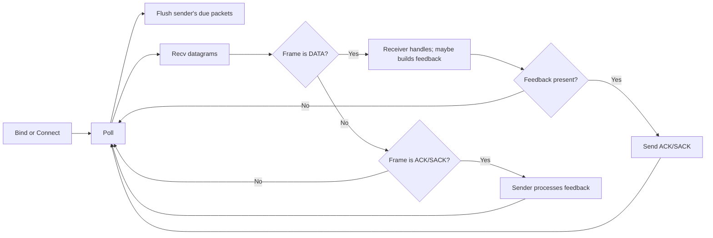
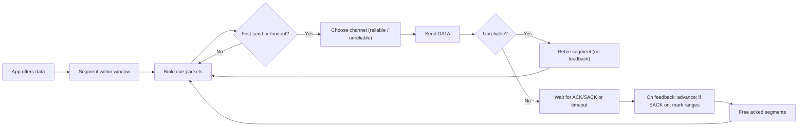
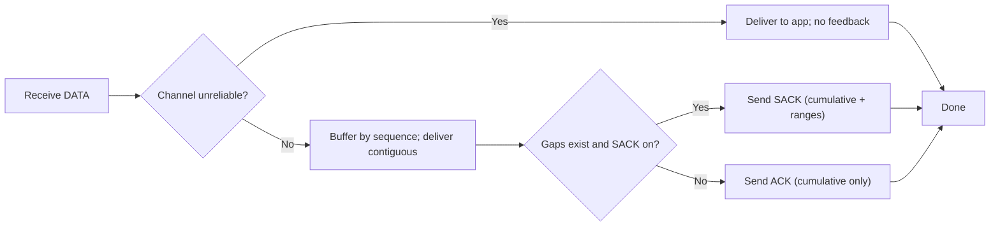

# Dual-Channel Transport Protocol (DCTP)

Hybrid two-channel transport for games: a **reliable (in-order)** path and an **unreliable (low-latency)** path over UDP. Reliability uses Selective Repeat with SACK-style feedback. This implementation is built as the submission for **CS3103 Assignment 4**.

---

## Why this exists

- **UDP as the substrate** — small, explicit, and perfect for experimenting with loss, reordering, and delay without hidden behavior from the kernel.
- **Two channels, one API** — most games want both: reliable delivery for state that must not be lost and lightweight updates where “latest wins.”
- **Selective Repeat + SACK** — retransmit only what’s missing for better efficiency on lossy links vs. GBN/stop-and-wait.

---

## Protocol Header Design

**Base header (14 Bytes)**:
`PacketType (1B) | ChannelType (1B) | SeqNo (4B) | Timestamp (4B) | Length (2B) | Checksum (2B)`

**ACK/SACK (9 Bytes)**: (Appended after base header for ACK and SACK packets)
`AckNo (4B) | ReceiverWindow (2B) | Timestamp (4B)`

**SACK Block Extension (2 + 8*N Bytes)**: (Appended after ACK/SACK for SACK packets)
`NumSackBlocks (2B) | [SackStart (4B) | SackEnd (4B)] * N`

---

## Features

- Reliable channel: SR-style window, per-segment timers, exponential backoff (RTO), duplicate/SACK-aware fast repair.
- Unreliable channel: no retransmit, out-of-order tolerated, latest state preferred.
- One UDP 5‑tuple for both channels (simple NAT traversal, one socket).
- Stats helpers to inspect throughput, loss/retx counts, and latency metrics (RTT/RTO) when enabled in verbose mode.
- CLI tools for quick local tests and scripted experiments.

---

## Project layout

```
.
├─ src/
│  ├─ dctp/              # core transport library (SR+SACK, timers, queues)
│  └─ cli/               # sender/receiver CLIs
├─ tests/                # unit tests
├─ pyproject.toml        # poetry configuration
└─ README.md
```

---

## Protocol Flowchart

### Transport


### Sender


### Receiver


## Quickstart

### Prerequisites
- Python 3.11+
- [Poetry](https://python-poetry.org/) 1.7+

### Install
```bash
poetry install
poetry run pre-commit install
```

### Run a local receiver
```bash
# Assuming the script dctp-recv is supported, otherwise use `python -m dctp.cli.dctp_recv`
poetry run dctp-recv --listen 127.0.0.1:9001 --out out.bin -v --sack
```

### Send traffic
```bash
# Assuming the script dctp-send is supported, otherwise use `python -m dctp.cli.dctp_send`
poetry run dctp-send --dst 127.0.0.1:9001 --num-packets 50 --rate 5 --prob-reliable 1.0 -v --sack
```


### Tests
```bash
poetry run coverage run -m pytest
```

### Coverage
```bash
# After running the tests script above
poetry run python -m coverage report
```

---

## API Specification

The `gameNetAPI` is implemented as the `Transport` class in `src/dctp/transport.py`.

### Methods

`__init__(window, prob_reliable, verbose)`
Creates a new `Transport` object.

* `prob_reliable` — float in `[0.0, 1.0]` that defines the probability that a packet sent with `send()` will be assigned to the **reliable** channel. This is the mechanism for marking data reliability.

`bind(address: Tuple[str, int])`
For a receiver. Binds the UDP socket to a local address to listen for packets.

`connect(address: Tuple[str, int])`
For a sender. Sets the single destination address for all outgoing packets.

`send(data: bytes) -> int`
Queues data for sending. The sender component will segment the data, assign a channel (based on `prob_reliable`), and buffer it for transmission. Returns the number of bytes accepted.

`recv(max_bytes: int) -> bytes`
Retrieves in-order data from the receiver's delivery buffer.

`poll(timeout_ms: int)`

* Flushes the sender's packet queue (sending due packets and retransmissions).
* Receives any pending packets from the UDP socket.
* Processes all received packets (ACKs, SACKs, DATA) to update sender and receiver states.

`drain()`
Blocks until the sender's inflight buffer is empty, ensuring all reliable packets have been acknowledged. Used for graceful shutdown.

`close()`
Closes the UDP


---

## Experiments

### Setup

- Network Emulator: `clumsy` (on Windows)
- Test Parameters: Our cli/send.py script allows variable packet rates. We used the following
command to run our tests, simulating a 6-second run at 50 packets/second:
    ```bash
    # (Total run time = 300 packets / 50 pps = 6 seconds)
    poetry run dctp-send --dst 127.0.0.1:9001 --num-packets 300 --rate 50 --prob-reliable 1.0 -v
    ```
- Network Condition:
    1. Low Loss: 0% packet loss, 50 ms latency
    2. High Loss: 20% packet loss, 50 ms latency
    3. With oof: 20% out-of-order

### Results

#### Reliable

| Number Of Packet | Rate (packets / s) | Lag (ms) | Drop rate (%) | Throughput (bytes/s) | Min RTT(ms) | max RTT (ms) | Average RTT(ms) | Packet Sent | Packet Received | PDR(%) |
| --- | --- | --- | --- | --- | --- | --- | --- | --- | --- | --- |
| 300.0 | 20.0 | 50.0 | 0.0 | 187.91 | 127.0 | 156.0 | 141.0 | 300.0 | 300.0 | 100 |
| 300.0 | 50.0 | 50.0 | 0.0 | 453.65 | 125.0 | 160.0 | 144.0 | 300.0 | 300.0 | 100 |
| 300.0 | 100.0 | 50.0 | 0.0 | 896.25 | 118.0 | 159.0 | 136.0 | 300.0 | 300.0 | 100 |
| 300.0 | 20.0 | 150.0 | 0.0 | 188.1 | 311.0 | 374.0 | 344.0 | 300.0 | 300.0 | 100 |
| 300.0 | 50.0 | 150.0 | 0.0 | 454.21 | 310.0 | 373.0 | 350.0 | 300.0 | 300.0 | 100 |
| 300.0 | 100.0 | 150.0 | 0.0 | 895.56 | 308.0 | 374.0 | 346.0 | 300.0 | 300.0 | 100 |
| 300.0 | 50.0 | 50.0 | 2.0 | 459.36 | 125.0 | 158.0 | 138.0 | 307.0 | 301.0 | 98.04560260586319 |
| 300.0 | 50.0 | 50.0 | 10.0 | 435.73 | 126.0 | 155.0 | 137.0 | 338.0 | 301.0 | 89.05325443786982 |
| 300.0 | 50.0 | 50.0 | 20.0 | 415.3 | 118.0 | 160.0 | 138.0 | 383.0 | 303.0 | 79.11227154046997 |


#### Unreliable

| Number Of Packet | Rate (packets / s) | Lag (ms) | Drop rate (%) | Throughput(bytes/s) | Packet Sent | Packet Received | PDR(%) |
| --- | --- | --- | --- | --- | --- | --- | --- |
| 300.0 | 10.0 | 50.0 | 0.0 | 95.96 | 300.0 | 300.0 | 100 |
| 300.0 | 20.0 | 50.0 | 0.0 | 187.52 | 300.0 | 300.0 | 100 |
| 300.0 | 50.0 | 50.0 | 0.0 | 459.27 | 300.0 | 300.0 | 100 |
| 300.0 | 10.0 | 150.0 | 0.0 | 95.65 | 300.0 | 300.0 | 100 |
| 300.0 | 20.0 | 150.0 | 0.0 | 188.86 | 300.0 | 300.0 | 100 |
| 300.0 | 50.0 | 150.0 | 0.0 | 459.34 | 300.0 | 300.0 | 100 |
| 300.0 | 50.0 | 50.0 | 2.0 | 458.17 | 300.0 | 291.0 | 97 |
| 300.0 | 50.0 | 50.0 | 10.0 | 454.79 | 300.0 | 278.0 | 92.66666666666666 |
| 300.0 | 50.0 | 50.0 | 20.0 | 459.27 | 300.0 | 242.0 | 80.66666666666666 |

---

## Design trade‑offs

- **Reliability vs latency:** the core trade‑off. Getting 100% delivery requires buffering, ACK/SACK signaling, timers, and occasional stalls.
- **Window sizing:** too small → underutilized link; too large → standing queues and bigger bursts on loss.
- **Single socket for both channels:** simpler I/O and NAT behavior, but congestion/backoff can couple the channels.

---

## Acknowledgements

- CS3103 teaching team
- Poetry + pre-commit
- GitHub Copilot for code documentation

---
